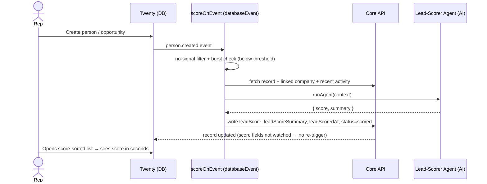
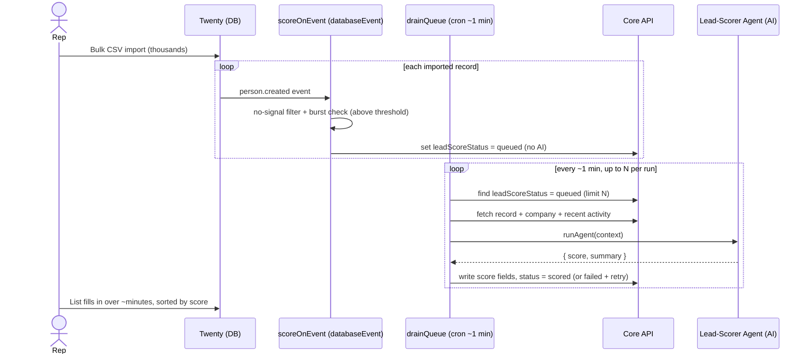

# PRD: AI Lead Scoring & Enrichment Agent for Twenty CRM

**App slug:** `lead-scoring-agent`
**Status:** Draft — pending approval
**Type:** Twenty App (SDK) — Field extensions + Agent + Logic Functions (databaseEvent + cron) + View
**Effort:** Medium (5–8 days for v1; the hybrid inline/queue path + dual-object enrichment is more than the original "2–4 day" estimate, which assumed person-only inline scoring)
**External dependencies:** None beyond Twenty's built-in AI credits

---

## Summary

An in-workspace AI agent that automatically scores every new or meaningfully-updated
`person` and `opportunity` record from 0–100 with a short reasoning summary, so a sales rep
can open a leads list sorted by score and instantly know what to work first. Scoring reads
the record plus its linked company and recent activity for context. A single manually-created
lead is scored inline within seconds; a bulk import is routed to a throttled queue drained by
a scheduled sweeper (~1-minute latency) to cap AI-credit cost and avoid rate limits.

## Problem Statement

A sales rep working a Twenty workspace has no automatic way to know which incoming lead
deserves attention first. New `person` and `opportunity` records land as flat rows with no
prioritization signal; the rep works them in arrival order or eyeballs each manually — slow,
inconsistent, and it degrades as volume grows, wasting time on cold leads and slowing response
to hot ones (where speed-to-lead most affects conversion).

**Affected:** the individual sales rep (primary — consumes the score daily) and their sales
manager (secondary — wants consistent, explainable triage across the team).

## Goals

- New/updated `person` and `opportunity` records receive a 0–100 score + 1–2 sentence reason
  automatically, with no manual action.
- The rep's leads list is **sorted by score by default**, while native sorting by any other
  column remains available.
- A **single manually-created** lead is scored within **seconds** (inline path).
- A **bulk import** is scored within **~1 minute** without a burst of AI calls or rate-limit
  errors (throttled queue path).
- Scoring stays **fresh** — a lead that gains a company, title, deal amount, or stage re-scores
  automatically; the rep never acts on a stale score.
- AI-credit cost stays **bounded and predictable** at real workspace volumes.

## Non-Goals

- Selling the app or listing it as a paid product (services-led distribution per `decisions.md`;
  no platform payment rails exist).
- A configurable scoring-rubric UI — the scoring prompt is code-defined in v1.
- Sub-second / true-real-time scoring.
- Scoring objects other than `person` and `opportunity`.

## Current State

- No native lead-scoring primitive exists in Twenty. The SDK docs *use* lead scoring as their
  canonical `defineAgent` example but ship nothing.
- Twenty App SDK is **GA at 2.22.0** (the original `01-ai-lead-scoring-agent.md` PRD's
  "alpha risk" is stale). GA logic functions use `defineLogicFunction` with
  `databaseEventTriggerSettings` / `cronTriggerSettings`, **not** the old
  `new TwentyFunction({ triggers: [...] })`.
- No existing Jira/Confluence prior art (searched aavisangle.atlassian.net — none found).
- Greenfield: scaffolding is `npx create-twenty-app lead-scoring-agent`.

## User Personas

| Persona | Description | Primary action |
|---|---|---|
| Sales rep | Works inbound leads daily in a Twenty workspace | Opens the score-sorted leads list, works top-down, reads the reason to decide |
| Sales manager | Oversees team triage consistency | Reviews scored pipeline; trusts scores are explainable and consistent |

## Proposed Solution

**Approach A — event-driven scoring — with a hybrid inline/queue execution model.**

Custom fields hold the score on both objects. A `databaseEvent` logic function fires on
create and on scoped updates. It applies a cheap no-signal filter, then a **burst detector**
decides execution:

- **Single manual create → inline:** score immediately via `runAgent()` in the handler →
  seconds-fresh.
- **Bulk create (burst) → enqueue:** mark `leadScoreStatus = 'queued'`, no AI call.

A **cron sweeper** drains `queued` records at a capped rate (N per run, ~1-minute cadence),
scores each, and writes results. A shipped **default INDEX view** on each object sorts by
`leadScore` desc; the rep re-sorts natively by any column.

Scoring context = the record's own fields + its linked **company** (size/industry/domain) +
**recent activity/notes**, fetched per scoring (bounded by the queue throttle).

**Burst detection:** the stateless handler counts same-object records created in the last
`BURST_WINDOW` (~10s); `< BURST_THRESHOLD` → inline, else enqueue. (See Open Questions — if the
GA event payload exposes an import-source flag, that replaces this heuristic.)

**Loop avoidance:** update triggers watch only business fields (never the score fields), so the
agent's own writes never re-trigger scoring.

### Behavioral Flows

Inline path — single manual create:

Queue path — bulk import + sweeper:

## Happy Path

1. Rep creates a single lead in the Twenty UI.
2. `scoreOnEvent` fires, passes the no-signal filter, burst check is below threshold → inline.
3. Handler fetches the record + linked company + recent activity, calls `runAgent()`.
4. Agent returns `{ score, summary }`; handler writes `leadScore`, `leadScoreSummary`,
   `leadScoredAt`, `leadScoreStatus = scored`.
5. Rep opens the leads list (default sorted by `leadScore` desc) and sees the new lead ranked,
   with the reason visible — within seconds.

## Edge Cases and Failure Modes

| Scenario | Expected behaviour |
|---|---|
| Bulk CSV import of thousands | Each create enqueues (`queued`, no AI); sweeper drains N/run at ~1 min; no burst of AI calls, no rate-limit errors |
| Record with no signal (no company & no title / no amount & no stage) | `leadScoreStatus = skipped`; no AI call, no score |
| Agent call fails (AI error / timeout) | `leadScoreStatus = failed`; next sweeper retries up to a bounded retry count, then leaves `failed` for visibility |
| Agent's own field writes | Update trigger watches only business fields → score writes never re-trigger scoring (loop-safe) |
| Meaningful update (title/company/amount/stage changes) | Re-scored via the same enqueue/inline path |
| AI permission flag missing | Function returns a clean error, sets `failed`; does not crash |
| Rep manually overrides a score | Respected until a watched business field changes (documented "last automated write wins on re-trigger") |

## Technical Constraints

- **Structured agent output requires a flat primitive schema** → cannot batch multiple records
  into one AI call. **Cost is ~1 AI call per scorable record**, regardless of trigger style. The
  throttle controls burst-rate and cost-per-window, not total calls.
- **AI-credit consumption** is the dominant cost. Guards: no-signal skip, cooldown via
  `leadScoredAt`, per-sweeper-run cap (N), and burst → queue.
- **Enrichment reads** (company + recent activity) add multiple Core API reads and a larger
  prompt per scoring — bounded by the queue throttle.
- **GA logic-function API:** `defineLogicFunction` + `databaseEventTriggerSettings` /
  `cronTriggerSettings`; event payload provides `{ before, after, diff, updatedFields }` and
  `recordId`. `runAgent()` (from `twenty-sdk/logic-function`) returns `{ result, error, success }`.
  `CoreApiClient` (from `twenty-client-sdk/core`) uses a typed query-builder
  (`client.query` / `client.mutation`).
- **Auth/permissions:** default app role must grant the AI permission flag or `runAgent()` fails;
  manifest needs read/write on `person`, `opportunity`, `company` (read), and activity objects (read).

## Scope

### Phase 1 (Current Work)

- `defineField` custom fields on **both** `person` and `opportunity`: `leadScore` (number),
  `leadScoreSummary` (text), `leadScoredAt` (datetime), `leadScoreStatus`
  (select: queued/scored/skipped/failed).
- One `defineAgent` (flat JSON schema `{ score, summary }`) invoked with **separate prompts**
  for person vs opportunity.
- Enrichment fetch: record + linked company + recent activity/notes.
- `scoreOnEvent` databaseEvent function: create + scoped-update triggers, no-signal filter,
  burst detector, **inline** score (below threshold) vs **enqueue** (burst).
- `drainQueue` cron function (~1 min): drains `queued` up to N/run, scores, writes,
  `failed` + bounded retry.
- Loop guard via watched-field scoping.
- Default `ViewKey.INDEX` views on both objects sorted by `leadScore` desc.
- Default app role granting the AI permission flag.

### Phase 2 (Future)

- Front-component color-coded score **badge** on record pages.
- No-AI heuristic tier-1 baseline for further cost reduction at scale.
- "Draft first outreach" skill; manager/team rollup views; score-change history.
- Replace burst heuristic with an SDK-native import-source flag if/when available.

### Out of Scope

- Marketplace/paid listing; configurable rubric UI; sub-second real-time scoring;
  objects beyond person/opportunity.

## Risks & Mitigations

| Risk | Impact | Mitigation |
|---|---|---|
| **No external demand** (idea is doc-driven, not requested) | Build a real tool nobody adopts | Early acceptance gate: validate score quality against a real rep's pipeline before hardening |
| AI-credit cost at volume | Expensive on busy workspaces | No-signal skip, cooldown, per-run cap, burst→queue; heuristic tier deferred to Phase 2 |
| Burst detection misclassifies (query lag / small imports) | A bulk import trickles through inline, or a manual create waits ~1 min | Tune `BURST_WINDOW`/`BURST_THRESHOLD`; confirm SDK import-source flag (Open Q) |
| Scoring not trusted by reps | Feature ignored | Always return a credible 1–2 sentence reason; validate spread on cold→hot test leads |
| GA API shape differs from assumed snippets | Rework during build | Open-Questions verification list; confirm at scaffold before writing logic |
| Manual score override clobbered on re-trigger | Rep frustration | Document behaviour; consider an "override lock" flag in Phase 2 |

## Acceptance Criteria

- [ ] New `person` and `opportunity` records get a `leadScore` (0–100) + non-empty
      `leadScoreSummary`.
- [ ] A single manually-created lead is scored **within seconds** (inline path).
- [ ] A bulk import of ≥1,000 records issues **no more than N AI calls per sweeper run** and
      completes scoring without rate-limit errors; records reach `scored` within ~minutes.
- [ ] Default leads list view is sorted by `leadScore` desc; re-sorting by another column works.
- [ ] Updating a watched business field re-scores; writing a score field does **not** re-trigger
      (verified: update `leadScore` via API → function does not fire).
- [ ] No-signal record → `skipped`, no AI call.
- [ ] Agent failure → `failed` + bounded retry via sweeper; no crash.
- [ ] Missing AI permission → clean error, not a crash.
- [ ] **Quality gate:** on a seeded set of obviously-cold → obviously-hot leads, scores show a
      sensible spread (validated with a real rep's judgement before sign-off).

## Technical Implementation Strategy

1. `npx create-twenty-app lead-scoring-agent`; `yarn twenty auth:login` against a sandbox
   workspace. Pin `twenty-sdk` at the current GA version.
2. **Fields:** `defineField` × 4 on `person`, × 4 on `opportunity` (`objectUniversalIdentifier`
   per object). Build + verify these + the `leadScoreStatus` enum before any logic.
3. **Agent:** `defineAgent` with `responseFormat: { type: 'json', schema: { score, summary } }`
   (flat primitives). Default role granting `SystemPermissionFlag.AI`.
4. **Enrichment helper:** given a record id + object type, fetch record + linked company +
   recent activity via `CoreApiClient` query-builder; assemble the object-specific prompt.
5. **`scoreOnEvent`** (`defineLogicFunction`, `databaseEventTriggerSettings`): triggers on
   `*.created` and scoped `*.updated` (person: `jobTitle`/`companyId`/`emails`; opportunity:
   `amount`/`stage`/`closeDate`). No-signal filter → `skipped`. Burst check → inline
   `runAgent` + write, or enqueue `queued`.
6. **`drainQueue`** (`defineLogicFunction`, `cronTriggerSettings`, ~1 min): find `queued`
   limit N → enrich → `runAgent` → write `scored` / `failed`(+retry count).
7. **Views:** `defineView({ key: ViewKey.INDEX, ... , sorts: [leadScore desc] })` for person
   and opportunity.
8. **Tests:** unit-test both handlers with mocked `runAgent`; test loop guard, no-signal skip,
   burst→queue, failure→retry.
9. `yarn twenty app:dev` for local verification; `yarn twenty app:sync` to deploy;
   `yarn twenty function:logs` to monitor.

Key components: `src/objects/*` (field extensions), `src/agents/lead-scorer.agent.ts`,
`src/roles/default-role.ts`, `src/functions/score-on-event.function.ts`,
`src/functions/drain-queue.function.ts`, `src/views/*`, `src/lib/enrich.ts`,
`src/lib/build-prompt.ts`.

## Open Questions

> **Resolved 2026-07-20** by the TCA-6 spike against installed SDK types — see
> `docs/decisions/D-TCA-ga-api-shapes.md`. Q1/Q2/Q4/Q5 + the `defineField` shape are confirmed;
> the burst-count heuristic (and Q6) is **replaced** by the native `createdBy.source` ACTOR flag;
> Q3 (event-name pluralization) is carried to TCA-9 for live confirmation. Original list retained below.

- **Import-source flag:** Does the GA `databaseEvent` payload expose whether a create came from
  CSV import / batch API vs manual UI? If yes, use it instead of the count-based burst heuristic.
- **CoreApiClient shape:** Confirm exact GA methods for read/write (query-builder
  `client.query`/`client.mutation` vs any helper wrappers) and how relations are connected.
- **`eventName` pluralization:** docs show both `people.created` and `person.updated` — confirm
  the exact object event names for `person` and `opportunity` at scaffold.
- **`defineView` sorts schema:** confirm the exact `sorts` array shape (field identifier +
  direction) for a shipped INDEX view.
- **Recent-activity model:** confirm which standard object(s) hold notes/activities/timeline
  events and the query to fetch "recent N for a record."
- **Burst tuning defaults:** initial `BURST_WINDOW` (~10s), `BURST_THRESHOLD` (~5), sweeper `N`
  and cadence — set provisional values, tune against a real import.
